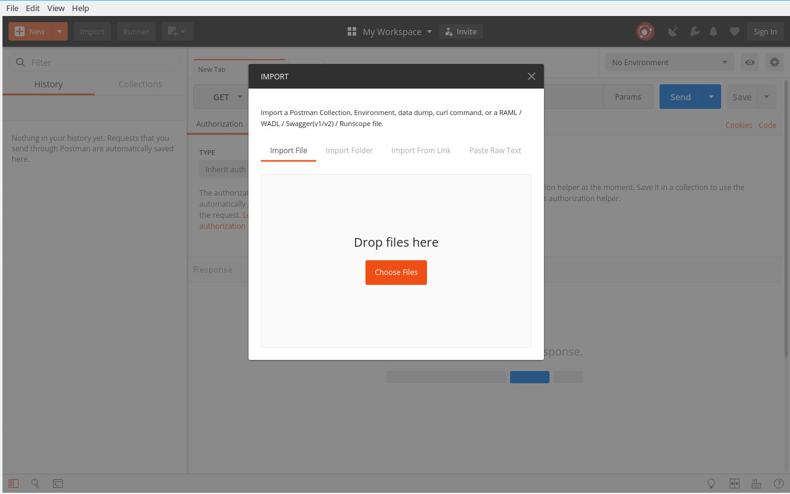
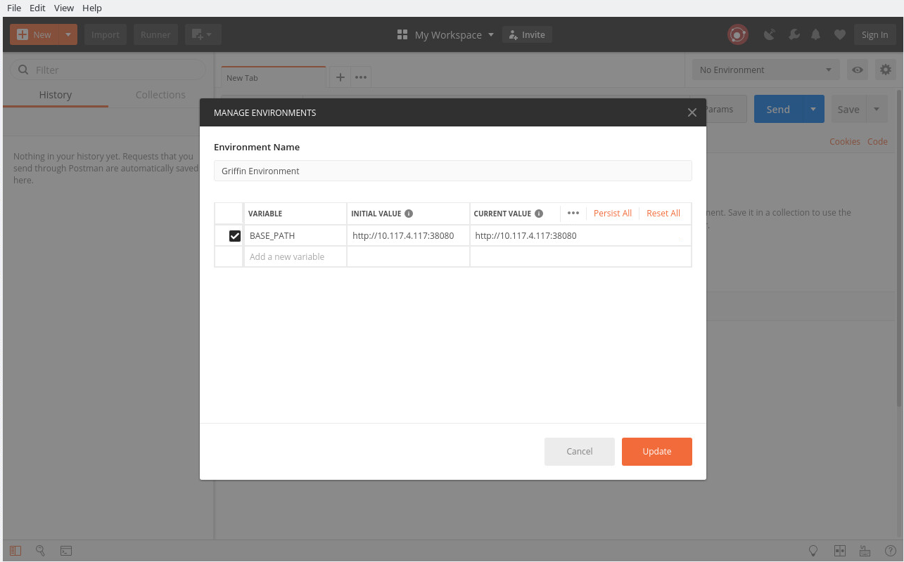
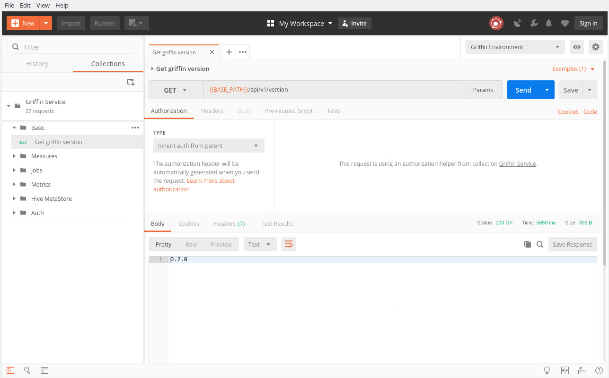
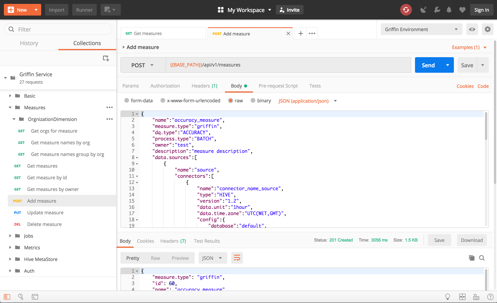
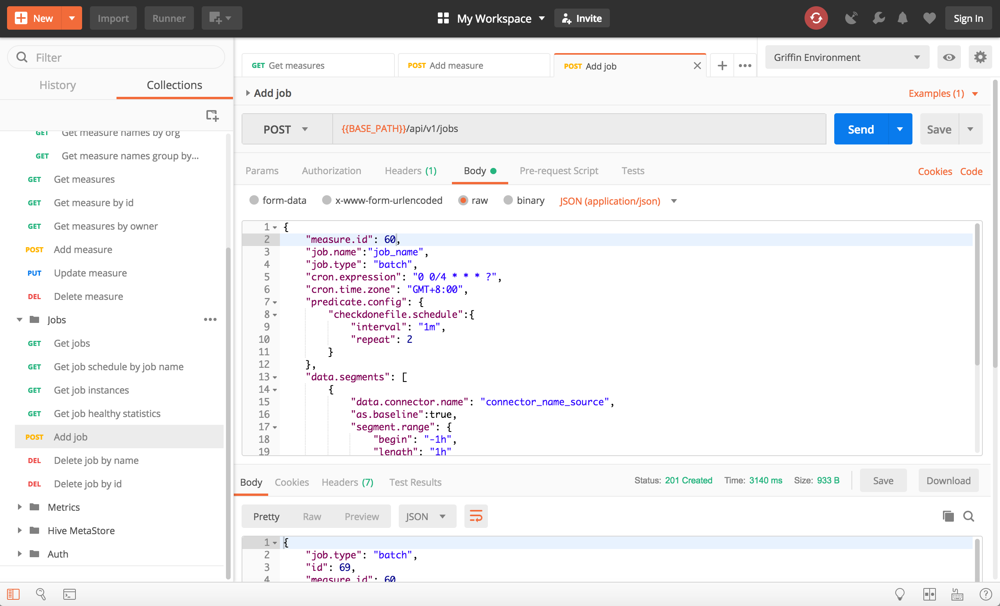

<!--
Licensed to the Apache Software Foundation (ASF) under one
or more contributor license agreements.  See the NOTICE file
distributed with this work for additional information
regarding copyright ownership.  The ASF licenses this file
to you under the Apache License, Version 2.0 (the
"License"); you may not use this file except in compliance
with the License.  You may obtain a copy of the License at

  http://www.apache.org/licenses/LICENSE-2.0

Unless required by applicable law or agreed to in writing,
software distributed under the License is distributed on an
"AS IS" BASIS, WITHOUT WARRANTIES OR CONDITIONS OF ANY
KIND, either express or implied.  See the License for the
specific language governing permissions and limitations
under the License.
-->

# Apache Griffin Docker Guide
Griffin docker images are pre-built on docker hub, users can pull them to try Apache Griffin in docker.

## Preparation

### Environment preparation
1. Install [docker](https://docs.docker.com/engine/installation/) and [docker compose](https://docs.docker.com/compose/install/).
2. Increase vm.max_map_count of your local machine(linux), to use elasticsearch.
    ```
    sysctl -w vm.max_map_count=262144
    ```
    For macOS, please increase enough memory available for docker (For example, set more than 4 GB in docker->preferences->Advanced) or decrease memory for es instance(For example, set -Xms512m -Xmx512m in jvm.options)

    For other platforms, please reference to this link from elastic.co
    [max_map_count kernel setting](https://www.elastic.co/guide/en/elasticsearch/reference/current/docker.html)
    
3. Pull Apache Griffin pre-built docker images, but if you access docker repository easily(NOT in China).
    ```
    docker pull apachegriffin/griffin_spark2:0.3.0
    docker pull apachegriffin/elasticsearch
    docker pull apachegriffin/kafka
    docker pull zookeeper:3.5
    ```
   For Chinese users, you can pull the images from the following mirrors.
    ```
    docker pull registry.docker-cn.com/apachegriffin/griffin_spark2:0.3.0
    docker pull registry.docker-cn.com/apachegriffin/elasticsearch
    docker pull registry.docker-cn.com/apachegriffin/kafka
    docker pull zookeeper:3.5
    ```
   The docker images are the Apache Griffin environment images.
    - `apachegriffin/griffin_spark2`: This image contains mysql, hadoop, hive, spark, livy, Apache Griffin service, Apache Griffin measure, and some prepared demo data, it works as a single node spark cluster, providing spark engine and Apache Griffin service.
    - `apachegriffin/elasticsearch`: This image is based on official elasticsearch, adding some configurations to enable cors requests, to provide elasticsearch service for metrics persist.
    - `apachegriffin/kafka`: This image contains kafka 0.8, and some demo streaming data, to provide streaming data source in streaming mode.
    - `zookeeper:3.5`: This image is official zookeeper, to provide zookeeper service in streaming mode.

### How to use Apache Griffin docker images in batch mode
1. Copy [docker-compose-batch.yml](compose/docker-compose-batch.yml) to your work path.
2. In your work path, start docker containers by using docker compose, wait for about one minute, then Apache Griffin service is ready.
    ```bash
    $ docker-compose -f docker-compose-batch.yml up -d
    ```
    After approximate one minute, you can check result. If result looks like below, it means startup is successful.
    ```bash
    $ docker container ls
    CONTAINER ID        IMAGE                                COMMAND                  CREATED             STATUS              PORTS                                                                                                                                                                                                                                                                                                                                                    NAMES
    bfec3192096d        apachegriffin/griffin_spark2:0.3.0   "/etc/bootstrap-al..."   5 hours ago         Up 5 hours          6066/tcp, 8030-8033/tcp, 8040/tcp, 9000/tcp, 10020/tcp, 19888/tcp, 27017/tcp, 49707/tcp, 50010/tcp, 50020/tcp, 50070/tcp, 50075/tcp, 50090/tcp, 0.0.0.0:32122->2122/tcp, 0.0.0.0:33306->3306/tcp, 0.0.0.0:35432->5432/tcp, 0.0.0.0:38042->8042/tcp, 0.0.0.0:38080->8080/tcp, 0.0.0.0:38088->8088/tcp, 0.0.0.0:38998->8998/tcp, 0.0.0.0:39083->9083/tcp   griffin
    fb9d04285070        apachegriffin/elasticsearch          "/docker-entrypoin..."   5 hours ago         Up 5 hours          0.0.0.0:39200->9200/tcp, 0.0.0.0:39300->9300/tcp                                                                                                                                                                                                                                                                                                         es
    ```
3. Now you can try Apache Griffin APIs by using any http client, here we use [postman](https://github.com/postmanlabs/postman-app-support) as example.
We have prepared two postman configuration files, you can download them from [json files](../service/postman).<br><br>For sake of usage, you need to import two files into postman firstly.<br><br>
<br><br>
And change the initial environment `BASE_PATH` value to `<your local IP address>:38080`.<br><br>
<br><br>
4. You can try the api `Basic -> Get griffin version`, to make sure Apache Griffin service has started up.<br><br>
<br><br>
5. Add an accuracy measure through api `Measures -> Add measure`, to create a measure in Apache Griffin.<br><br>
<br><br>
6. Add a job to through api `jobs -> Add job`, to schedule a job to execute the measure. In the example, the schedule interval is 5 minutes.<br><br>
<br><br>
7. After some minutes, you can get the metrics from elasticsearch.
    ```bash
    curl -XGET '<IP Address>:39200/griffin/accuracy/_search?pretty&filter_path=hits.hits._source' \
    -d '{"query":{"match_all":{}},  "sort": [{"tmst": {"order": "asc"}}]}'
    
    # json metric data returned
    {
      "hits" : {
        "hits" : [
          {
            "_source" : {
              "name" : "metricName",
              "tmst" : 1509599811123,
              "value" : {
                "__tmst" : 1509599811123,
                "miss" : 11,
                "total" : 125000,
                "matched" : 124989
              }
            }
          },
          {
            "_source" : {
              "name" : "metricName",
              "tmst" : 1509599811123,
              "value" : {
                "__tmst" : 1509599811123,
                "miss" : 11,
                "total" : 125000,
                "matched" : 124989
              }
            }
          }
        ]
      }
    }
    ```

### How to use Apache Griffin docker images in streaming mode
1. Copy [docker-compose-streaming.yml](compose/docker-compose-streaming.yml) to your work path.
2. In your work path, start docker containers by using docker compose, wait for about one minutes, then Apache Griffin service is ready.
    ```
    docker-compose -f docker-compose-streaming.yml up -d
    ```
3. Enter the Apache Griffin docker container.
    ```
    docker exec -it griffin bash
    ```
4. Switch into the measure directory.
    ```
    cd ~/measure
    ```
5. Execute the script of streaming-accu, to execute streaming accuracy measurement.
    ```
    ./streaming-accu.sh
    ```
   You can trace the log in streaming-accu.log.
    ```
    tail -f streaming-accu.log
    ```
6. Limited by the docker container resource, you can only execute accuracy or profiling separately.
   If you want to try streaming profiling measurement, please kill the streaming-accu process first.
    ```
    kill -9 `ps -ef | awk '/griffin-measure/{print $2}'`
    ```
   Then clear the checkpoint directory and other related directories of last streaming job.
    ```
    ./clear.sh
    ```
   Execute the script of streaming-prof, to execute streaming profiling measurement.
    ```
    ./streaming-prof.sh
    ```
   You can trace the log in streaming-prof.log.
    ```
    tail -f streaming-prof.log
    ```
