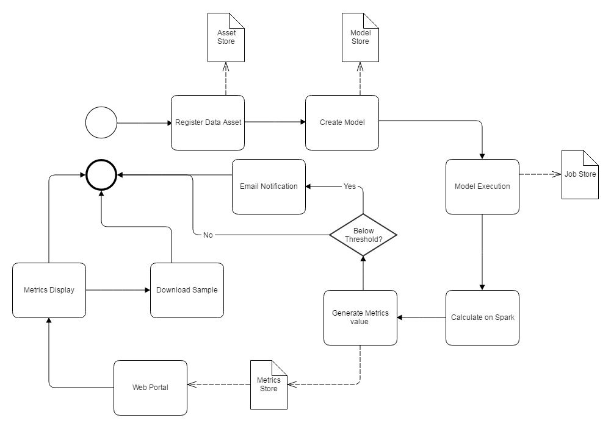
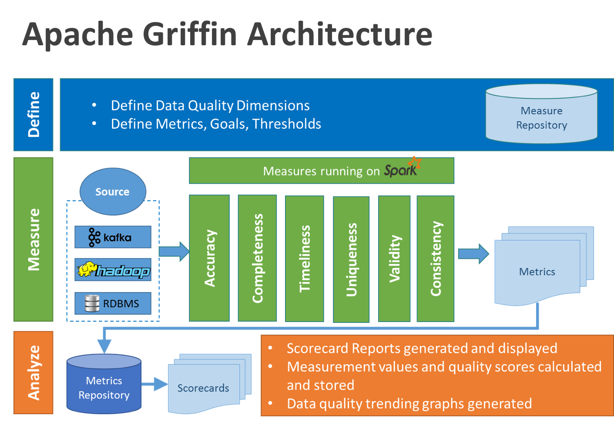
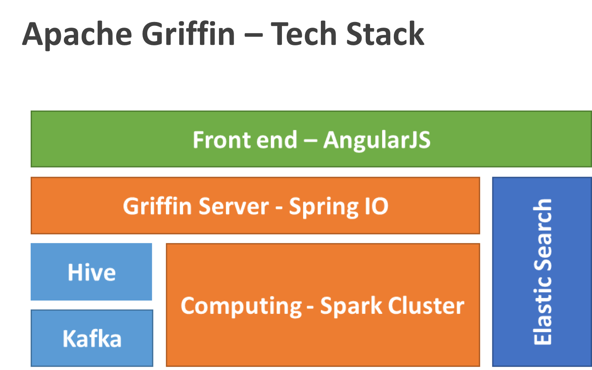

## Abstract
Apache Griffin is a Data Quality Service platform built on Apache Hadoop and Apache Spark. It provides a framework process for defining data quality model, executing data quality measurement, automating data profiling and validation, as well as a unified data quality visualization across multiple data systems.  It tries to address the data quality challenges in big data and streaming context.

## Overview of Apache Griffin  
When people use big data (Hadoop or other streaming systems), measurement of data quality is a big challenge. Different teams have built customized tools to detect and analyze data quality issues within their own domains. As a platform organization, we think of taking a platform approach to commonly occurring patterns. As such, we are building a platform to provide shared Infrastructure and generic features to solve common data quality pain points. This would enable us to build trusted data assets.

Currently it is very difficult and costly to do data quality validation when we have large volumes of related data flowing across multi-platforms (streaming and batch). Take eBay's Real-time Personalization Platform as a sample; Everyday we have to validate the data quality for ~600M records. Data quality often becomes one big challenge in this complex environment and massive scale.

We detect the following at eBay:

1. Lack of an end-to-end, unified view of data quality from multiple data sources to target applications that takes into account the lineage of the data. This results in a long time to identify and fix data quality issues.
2. Lack of a system to measure data quality in streaming mode through self-service. The need is for a system where datasets can be registered, data quality models can be defined, data quality can be visualized and monitored using a simple tool and teams alerted when an issue is detected.
3. Lack of a Shared platform and API Service. Every team should not have to apply and manage own hardware and software infrastructure to solve this common problem.

With these in mind, we decided to build Apache Griffin - A data quality service that aims to solve the above short-comings.

Apache Griffin includes:

**Data Quality Model Engine**: Apache Griffin is model driven solution, user can choose various data quality dimension to execute his/her data quality validation based on selected target data-set or source data-set ( as the golden reference data). It has corresponding library supporting it in back-end for the following measurement:

 - Accuracy - Does data reflect the real-world objects or a verifiable source
 - Completeness - Is all necessary data present
 - Validity -  Are all data values within the data domains specified by the business
 - Timeliness - Is the data available at the time needed
 - Anomaly detection -  Pre-built algorithm functions for the identification of items, events or observations which do not conform to an expected pattern or other items in a dataset
 - Data Profiling - Apply statistical analysis and assessment of data values within a dataset for consistency, uniqueness and logic.

**Data Collection Layer**:

We support two kinds of data sources, batch data and real time data.

For batch mode, we can collect data source from  our Hadoop platform by various data connectors.

For real time mode, we can connect with messaging system like Kafka to near real time analysis.

**Data Process and Storage Layer**:

For batch analysis, our data quality model will compute data quality metrics in our spark cluster based on data source in hadoop.

For near real time analysis, we consume data from messaging system, then our data quality model will compute our real time data quality metrics in our spark cluster. for data storage, we use time series database in our back end to fulfill front end request.

**Apache Griffin Service**:

We have RESTful web services to accomplish all the functionalities of Apache Griffin, such as exploring data-sets, create data quality measures, publish metrics, retrieve metrics, add subscription, etc. So, the developers can develop their own user interface based on these web serivces.

## Main business process

## Main architecture diagram

## Main tech stack diagram

## Rationale
The challenge we face at big data ecosystem is that our data volume is becoming bigger and bigger, systems process become more complex, while we do not have a unified data quality solution to ensure the trusted data sets which provide confidences on data quality to our data consumers.  The key challenges on data quality includes:

1. Existing commercial data quality solution cannot address data quality lineage among systems, cannot scale out to support fast growing data at eBay
2. Existing eBay's domain specific tools take a long time to identify and fix poor data quality when data flowed through multiple systems
3. Business logic becomes complex, requires data quality system much flexible.
4. Some data quality issues do have business impact on user experiences, revenue, efficiency & compliance.
5. Communication overhead of data quality metrics, typically in a big organization, which involve different teams.

The idea of  Apache Apache Griffin is to provide Data Quality validation as a Service, to allow data engineers and data consumers to have:

 - Near real-time understanding of the data quality health of your data pipelines with end-to-end monitoring, all in one place.
 - Profiling, detecting and correlating issues and providing recommendations that drive rapid and focused troubleshooting
 - A centralized data quality model management system including rule, metadata, scheduler etc.  
 - Native code generation to run everywhere, including Hadoop, Kafka, Spark, etc.
 - One set of tools to build data quality pipelines across all eBay data platforms.
