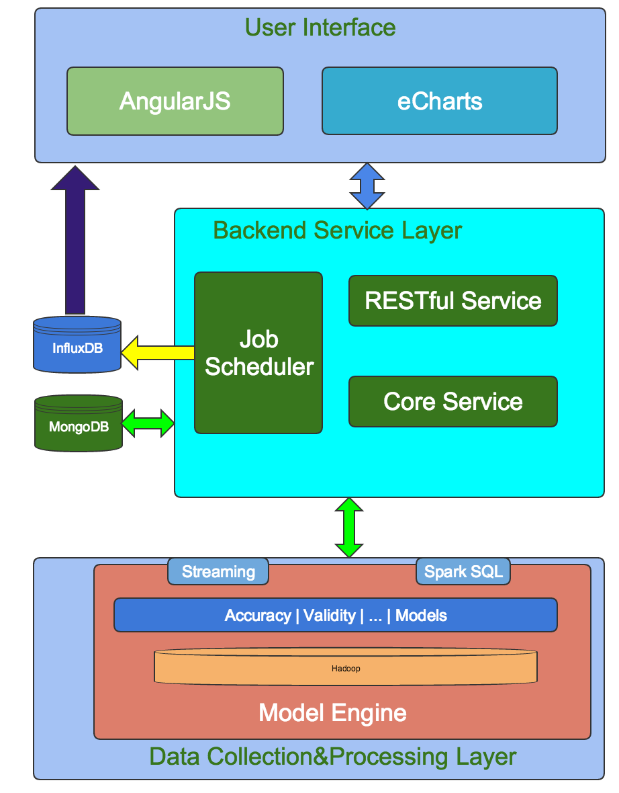
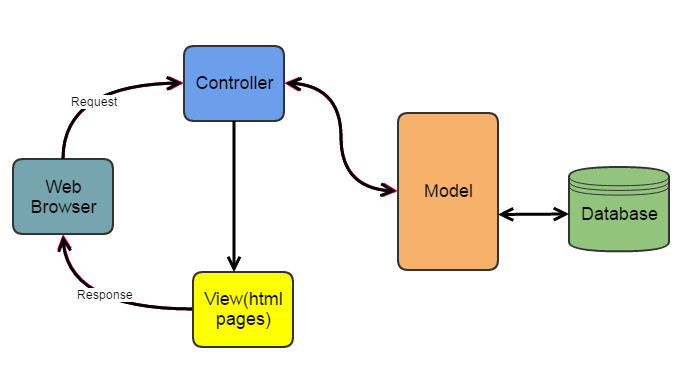
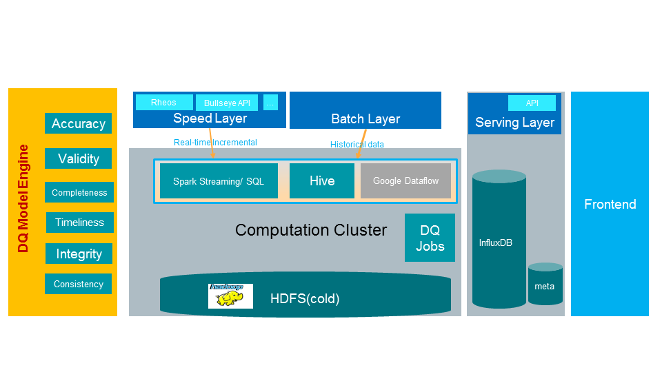

# Technical Design Document

## System Architecture
There are 3 main parts of the system: Web UI, Backend Services, and Measure engine on Hadoop. Please refer to the below high level architecture diagram

## Web UI
- AngularJS 1.5.7 - https://angularjs.org/
- eCharts 3.2.2 - http://echarts.baidu.com/
- Bootstrap 3.3.6 - http://getbootstrap.com

## Backend Service Layer
There are several key componets hosted on the web server, such as RESTful web service, Job scheduler, Core Service. We provides RESTful APIs to support all kinds of clients(web browser, mobile app, applications on PC, etc.). The Job scheduler is responsible for triggering the execution of the measures and persist the metrics values. The Metadata engine is to provide most of the management features such as measure management, data asset management, notification management, user settings, etc.

### RESTful Service
#### Concepts
We follow the principles in https://codeplanet.io/principles-good-restful-api-design/ to build up our RESTful web services.

**Root URL**: https://example.org/api/v1/*

**Verbs**:
- GET (SELECT): Retrieve a specific Resource from the Server, or a listing of Resources.
- POST (CREATE): Create a new Resource on the Server.
- PUT (UPDATE): Update a Resource on the Server, providing the entire Resource.
- PATCH (UPDATE): Update a Resource on the Server, providing only changed attributes.
- DELETE (DELETE): Remove a Resource from the Server.

#### Technical framework
Jersey: https://jersey.java.net/

And the resources should be authorized. Refer to https://jersey.java.net/documentation/latest/security.html

### Job Scheduler
May leverage QUARTZ: http://www.quartz-scheduler.org/

<TBD>

### Core Service
Here are the key components in Core Service:
- data asset management
- measure management
- metrics subscription
- notification component
- user settings

For each component, we follow the MVC-based architecture.

Here're the typical classes/interfaces for each component

## Data Collection&Processing Layer

For data ingestion, griffin can consume real time data from streaming and also support batch data like sql or structured files.

For data processing, griffin provides several measure libraries for various data quality dimensions like accuracy, validity, etc.

After appending business rules into those measures, griffin will deploy related jobs in spark cluster.

For more details of the design, please refer to https://github.com/eBay/DQSolution/blob/master/griffin-doc/measures.md
