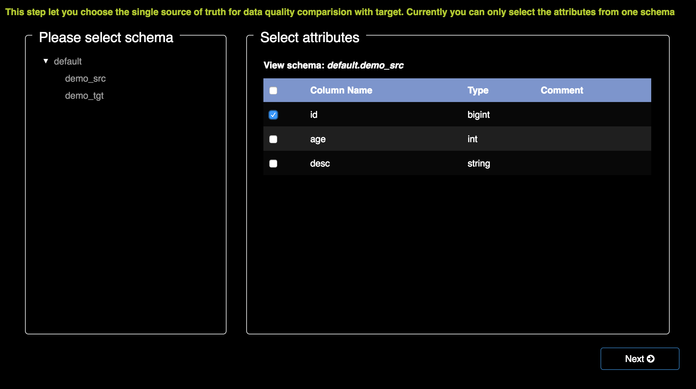
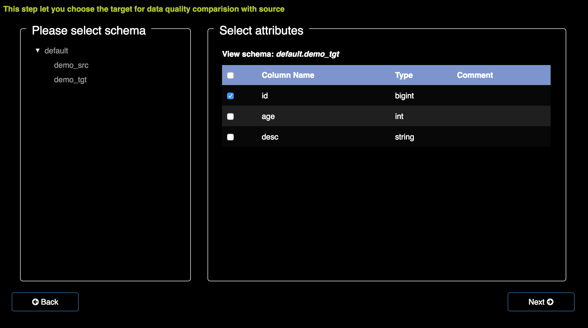

# Apache Griffin User Guide

## 1 Introduction & Access

- Apache Griffin is an open source Data Quality solution for distributed data systems at any scale in both streaming or batch data context.
- Users will primarily access this application from a PC.

## 2 Procedures

After you log into the system, you may follow the steps:

1. First, create a new data asset.
2. Then, choose one model to process the data.
3. The heatmap will show all the data diagrams.
4. Finally, use the dashboard to show the data diagram you are interested in.

### 2.1 Data Asset

First, you have to create a new data asset by clicking "DataAssets".

Click “Register Data Asset” to create a new record. The information required are listed below:

1. Asset name  
Write a valid name into the blank.
2. Asset type  
There are mainly two types, inclouding hdfsfile and hivetable.
3. HDFS Path  
Input a valid path in the blank, example: /user/b_des/yosha/dr.
4. Platform  
There are several options provided: Bullseye, GPS, Hadoop, PDS, IDLS, Pulsar, Kafka, Sojourner, Sitespeed, EDW. Choose one platform from them.
5. Schema  
Enter name and type in the blank.

### 2.2 Create model

By clicking "Models", and then choose"Create DQ Model". You can use the model to process data and get the result you want.

There are mainly four kinds of DQ models for you to choose, which are:

1. if you want to measure the differencial rate between source and target, choose accuracy.
2. if you want to check the specific value of the data(such as:null column count), choose validity.
3. if you want to detect wrong data information, choose anomaly detection.
4. if you have already process the data by yourself, choose publish DQ metrics directly, POST it any time you want, and see the trend from data diagrams.

#### **2.2.1 Accuracy** [[1]](#accuracy)

**Definition:**

Measured by how the values agree with an identified source of truth.

**Steps:**

1)      Choose source

Select the source dataset and fields which will be used for comparision.

For example, we choose 2 columns here.

2)      Choose target:

Select the target dataset and fields which will be used for comparision.

3)      Mapping source and target

- Step1:  On the left side of the page,select a prime key in “PK” column.
- Step2:  Then, select whcih rule to match the source and the target. Here are 5 options to choose:
  1. Exactly match: each column in the two columns should be 100% matched.
  2. Length: only match whether the length of the two colums is the same.
  3. Lower case: all the characters wiil be set in lower case, and then compare whether they are the same.
  4. Upper case:all the characters wiil be set in upper case, and then compare whether they are the same.
  5. Trim: all the blank space will be removed, and then compare whether they are the same.
- Step3:  Source fields:choose the which source that you want to compare with the target.

4)      Configuration

Set up the model required information.

Set a threshold, the value below it will be set into red, then you will know that the data has been changed while transmitting.

5)      Status

After you create a new accuracy model,there are three status:

1. **Testing:**This means the data is still in processing.
2. **Need verify:**The data has already been processed, you can check the result by clicking the model's name.If you are satisified with the final result, you can click 'deploy' button to set the model into 'deployed' mode.
3. **Deployed:**The model will be processed everyt time interval as you set in the schedule type.

**Example:**

Suppose the source table A has 1000 records and the target table B only has 999 records which can perfectly match with A in selected fields, then the accuracy rate=999/1000*100%=99.9%.

#### **2.2.2 Validity**

**Definition:**

Data is valid if it confirms to the system (format, type, values) of its definition.

**Steps:**

1)      Choose target

Select the target dataset and fields which you want to be checked.

2)      Define/select models

Define your syntax check logic which will be applied on the selected fields.

  - Simple Statistics  
**Null Count:** null is a special marker used to indicate that a data value does not exist, this pattern statistics the amout of null columns.    
**Unique Count:** the unique constraint prevents two records from having identical values in a particular colum, this pattern statistics the amout of unique columns.   
**Duplicate Count:** duplicate count is the number of duplicate rows in a table and generate an output column that shows how many times each row occurs.
  - Summary Statistics   
**Maximum:** maximum is the bigggest value of the selected column.    
**Minimum:** minimum is the smallest value of the selected column.    
**Mean:** mean is the usual average of the selected column.   
**Medium:** medium is the middle value of the selected column.    
  - Advanced Statistics  
In theoretical computer science and formal language theory, a regular expression (sometimes called a rational expression) is a sequence of characters that define a search pattern, mainly for use in pattern matching with strings, or string matching, i.e. "find and replace"-like operations.

3)      Configurations

Set the basic information which are required for your model.

4)      Status

After you create a new validity model,there are three status:

1. **Testing:**This means the data is still in processing.
2. **Need verify:**The data has already been processed, you can check the result by clicking the model's name.If you are satisified with the final result, you can click 'deploy' button to set the model into 'deployed' mode.
3. **Deployed:**The model will be processed everyt time interval as you set in the schedule type.

**Example1:**

Check the date scope of all records in Column A, which should be char(1) in one dataset.

**Example2:**

Check the data range (minimum, maximum) within a set of allowable values.

#### **2.2.3 Anomaly Detection**

**Definition:**

Identification of items, events or observations which do not confirm to an expected pattern or other items in a dataset.    
According to the threshold you set, the unusual data will be detected, system will send an e-mail notification to the users to remind them of the abnormal data.

**Steps:**

1)      Choose target

Select the target dataset and fields which you want to be checked.

2)      Define/select models

Select the pre-defined anomaly detection methods which will be applied on the selected fields.

  - **History Trend Detection**   
This is a method of evaluating two or more measured events to compare the results at one time period with those from another time period(or series of time periods), on an yearly, monthly, weekly, daily or hourly basis. Currently weekly comparision is supported.
  - **Deviation Detection(Based on MAD)**   
Deviation detection algorithm usually look at a given time window of a metric time series and establish and upper and lower band of accepted deviations and assume any data point out of those band as a deviation.   
The incorrect data will be marked out on the diagram.
  - **Bollinger Bands Detection**    
Bollinger Bands are volatility bands placed above and below a moving average. Volatility is based on the standard deviation. which changes as volatility increases and decreases. The bands automatically widen when volatility increases and narrow when volatility decreases.

3)      Configuration

Set the basic information which are required for your model.

4)      Status

After you create a new model,the status will be set in 'deployed' directly.

**Example1:**

Check the total row count changed day over day (or hour over hour) on one dataset.

**Example2:**

Check the values of all records in Column A should be matched with one expression pattern (first 3 characters should be ‘abc’) in one dataset.

#### **2.2.4 Publish DQ Metrics Directly**

**Definition:**

This is used to publish DQ results which has already calculated offline by customers.

**Step:**

Configuration: Set the basic information which are required for your model.

**Method:**

POST

**Publish data format:**

Method: POST    
  &nbsp;&nbsp;&nbsp;&nbsp; Endpoint: [https://localhost:8080/api/v1/metrics](https://localhost:8080/api/v1/metrics)    
  &nbsp;&nbsp;&nbsp;&nbsp; Body:    
  &nbsp;&nbsp;&nbsp;&nbsp; {     
    &nbsp;&nbsp;&nbsp;&nbsp;&nbsp;&nbsp;&nbsp;&nbsp; "metricName": "",   
    &nbsp;&nbsp;&nbsp;&nbsp;&nbsp;&nbsp;&nbsp;&nbsp; "timestamp": 1463373496583,    
    &nbsp;&nbsp;&nbsp;&nbsp;&nbsp;&nbsp;&nbsp;&nbsp; "value": 99.9   
  &nbsp;&nbsp;&nbsp;&nbsp; }

**Status:**

After you create a new model,the status will be set in 'deployed' directly.

## 5 Heatmap

After the processing work has done, here are 3 ways to show the data diagram.   

1. The blocks in green represent health and the blocks in red represent invalid.    

   

2. Clcik on "DQ Metrics"  

     

   - You can see all the metrics diagrams are shown on the page.

   

   - For the type accuracy and validity, you can also download the model sample.By clicking 'Download sample',you may get a list of 20 recently added models, choose the one you want to download.

   

   - By clicking on the diagram, you can get the zoom-in picture of it, and know the DQ metrics at the selected time window.  

   

3. The metrics is shown on the right side of the page. By clicking on the number, you can get the diagram and details about the data.   

   

## 6 My Dashboard

User can subscribe a metrics so that it can be displayed on "my dashboard".  

Subscribe steps:    
1. Select Org->Asset    
a)      Can select on Org level, then all the assets under this Org will be selected    
b)      Can select on Asset level    
c)      Can multiple select     
2. After the assets are selected, all the models under these assets shouldbe displayed, so that the end user will know which metrics he's selected
3. Do subscription, then you may get the result as follow.

All the diagrams that you want to keep tracking are shown on 'my dashboard' page.

## References
###Six core data quality dimensions

*Content adapted from [THE SIX PRIMARY DIMENSIONS FOR DATA QUALITY ASSESSMENT](http://www.damauk.org/RWFilePub.php?&cat=403&dx=1&ob=3&rpn=catviewleafpublic403&id=106193), DAMA, UK*

| Title     | Accuracy |
| ----------|----------|
| Definition  | The degree to which data correctly describes the "real world" object or event being described.    |
| Reference | Ideally the "real world" truth is established through primary research. However, as this is often not practical, it is common to use 3rd party reference data from sources which are deemed trustworthy and of the same chronology. |
| Measure  | The degree to which the data mirrors the characteristics of the real world object or objects it represents. |
|   Scope  | Any "real world" object or objects that may be characterized or described by data, held as data item, record, data set or database. |
| Unit of Measure | The percentage of data entries that pass the data accuracy rules. |
| Type of Measure:  <ul><li>Assessment</li><li>Continuous</li><li>Discrete</li></ul>| Assessment, e.g. primary research or reference against trusted data. Continuous Measurement, e.g. age of students derived from the relationship between the students’ dates of birth and the current date. Discrete Measurement, e.g. date of birth recorded. |
| Related Dimension | Validity is a related dimension because, in order to be accurate, values must be valid, the right value and in the correct representation.|
| Optionality | Mandatory because - when inaccurate - data may not be fit for use. |
| Applicability | |
| Example(s) | A European school is receiving applications for its annual September intake and requires students to be aged 5 before the 31st August of the intake year.    In this scenario, the parent, a US Citizen, applying to a European school completes the Date of Birth (D.O.B) on the application form in the US date format, MM/DD/YYYY rather than the European DD/MM/YYYY format, causing the representation of days and months to be reversed.     As a result, 09/08/YYYY really meant 08/09/YYYY causing the student to be accepted as the age of 5 on the 31st August in YYYY.     The representation of the student’s D.O.B.–whilst valid in its US context–means that in Europe the age was not derived correctly and the value recorded was consequently not accurate |
| Pseudo code | ((Count of accurate objects)/ (Count of accurate objects + Counts of inaccurate objects)) x 100   Example: (Count of children who applied aged 5 before August/YYYY)/ (Count of children who applied aged 5 before August 31st YYYY+ Count of children who applied aged 5 after August /YYYY and before December 31st/YYYY) x 100|

| Title   | Validity |
| ------- | -------- |
| Definition| Data are valid if it conforms to the syntax (format, type, range) of its definition.|
| Reference| Database, metadata or documentation rules as to the allowable types (string, integer, floating point etc.), the format (length, number of digits etc.) and range (minimum, maximum or contained within a set of allowable values).|
| Measure | Comparison between the data and the metadata or documentation for the data item.|
| Scope | All data can typically be measured for Validity. Validity applies at the data item level and record level (for combinations of valid values).|
| Unit of Measure |Percentage of data items deemed Valid to Invalid. |
| Type of Measure:  <ul><li>Assessment</li><li>Continuous</li><li>Discrete</li></ul>|Assessment, Continuous and Discrete|
|Related dimension|Accuracy, Completeness, Consistency and Uniqueness|
|Optionality|Mandatory|
|Applicability| |
|Example(s)|Each class in a UK secondary school is allocated a class identifier; this consists of the 3 initials of the teacher plus a two digit year group number of the class. It is declared as AAA99 (3 Alpha characters and two numeric characters).  Scenario 1: A new year 9 teacher, Sally Hearn (without a middle name) is appointed therefore there are only two initials. A decision must be made as to how to represent two initials or the rule will fail and the database will reject the class identifier of “SH09”. It is decided that an additional character “Z” will be added to pad the letters to 3: “SZH09”, however this could break the accuracy rule. A better solution would be to amend the database to accept 2 or 3 initials and 1 or 2 numbers.   Scenario 2: The age at entry to a UK primary & junior school is captured on the form for school applications. This is entered into a database and checked that it is between 4 and 11. If it were captured on the form as 14 or N/A it would be rejected as invalid.|
|Pseudo code|Scenario 1: Evaluate that the Class Identifier is 2 or 3 letters a-z followed by 1 or 2 numbers 7 – 11.  Scenario 2: Evaluate that the age is numeric and that it is greater than or equal to 4 and less than or equal to 11. |
